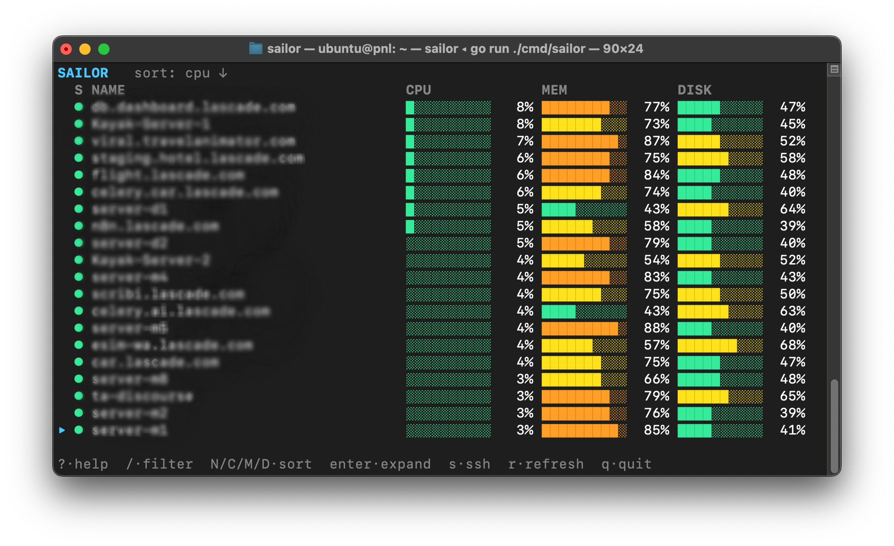
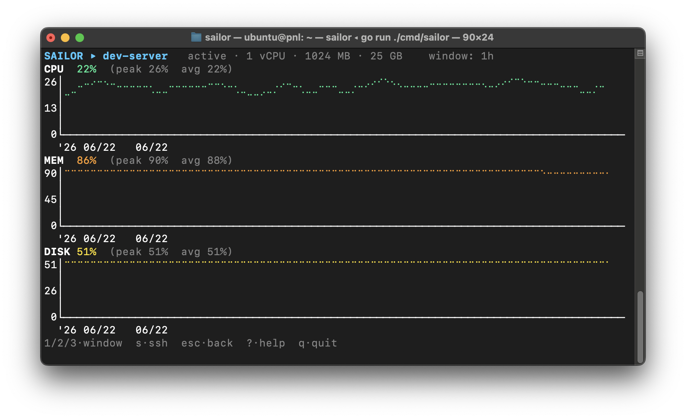

# ⛵ Sailor

Sailor is a terminal UI for watching your DigitalOcean Droplets. It shows live CPU, memory, and disk for each one, lets you sort and filter the list, opens usage charts for any Droplet, and hands off to `ssh` or `scp` when you need to get onto a box or push files to it.



It's one binary. The idea is to stop bouncing between the DigitalOcean console (for metrics) and a terminal (for SSH).

## What it does

- **Live usage** — CPU, memory, and disk per Droplet. Bars run from green through yellow and orange to red as load climbs.
- **Search and sort** — filter by name with `/`; sort by name, CPU, memory, or disk. The cursor stays on the same Droplet while the list re-sorts around it.
- **Charts** — press `enter` on a Droplet to see its CPU/memory/disk history as braille time-series, over the last 1h, 6h, or 24h.
- **SSH** — press `s` to drop into a shell. Sailor runs your system `ssh`, so your keys, agent, and `~/.ssh/config` all apply; the login is remembered per Droplet.
- **SCP** — press `u` to pick files or folders in a small browser and upload them to the Droplet's home directory. A progress bar tracks the transfer.
- **Kind to the rate limit** — DigitalOcean allows ~5,000 API calls/hour and each row costs three. Sailor only refreshes the Droplets near your cursor, so it holds up whether you run five or five hundred.
- **Quick to start** — the list is cached, so it's on screen right away while fresh numbers load behind it.
- **Read-only** — Sailor never changes your account through the API (no power, reboot, resize, or destroy). SSH and SCP act inside a server you already control.

> **Note on metrics:** DigitalOcean always exposes CPU, but **memory and disk usage require the [metrics agent](https://docs.digitalocean.com/products/monitoring/how-to/install-metrics-agent/) (`do-agent`)** on the Droplet. Droplets without it show CPU only (memory/disk as `n/a`); powered-off Droplets show `--`.

## Install

### Download a release

Grab a prebuilt binary from the [latest release](https://github.com/rohittp0/sailor/releases/latest):

```bash
# macOS (Apple Silicon)
curl -L https://github.com/rohittp0/sailor/releases/latest/download/sailor-darwin-arm64.tar.gz | tar xz

# Linux (x86-64)
curl -L https://github.com/rohittp0/sailor/releases/latest/download/sailor-linux-amd64.tar.gz | tar xz

./sailor
```

Binaries are published for macOS and Linux on both `amd64` and `arm64`.

### Go install

With Go 1.26+ on your `PATH`:

```bash
go install github.com/rohittp0/sailor/cmd/sailor@latest
```

This drops the `sailor` binary in `$(go env GOPATH)/bin`.

### Build from source

```bash
git clone https://github.com/rohittp0/sailor.git
cd sailor
go build -o sailor ./cmd/sailor
./sailor
```

## Usage

Sailor needs a DigitalOcean API token **with the Monitoring read scope** (a token without it lists Droplets but returns `403` on metrics). It is resolved in this order:

1. The `DIGITALOCEAN_ACCESS_TOKEN` environment variable.
2. Your existing [`doctl`](https://docs.digitalocean.com/reference/doctl/) config (`~/.config/doctl/config.yaml`, current context).

```bash
export DIGITALOCEAN_ACCESS_TOKEN=dop_v1_xxx
sailor

# …or, if doctl is already authenticated:
sailor
```

### Keybindings

| Key | Action |
| --- | --- |
| `j` / `k`, `↓` / `↑` | Move cursor |
| `g` / `G` | Jump to top / bottom |
| `ctrl+d` / `ctrl+u` | Page down / up |
| `/` | Filter by name (`esc` clears) |
| `N` / `C` / `M` / `D` | Sort by name / CPU / memory / disk |
| `enter` / `e` | Expand to charts |
| `s` / `S` | SSH / edit SSH profile |
| `u` | Upload files/folders (SCP) |
| `r` | Refresh all |
| `1` / `2` / `3` | Chart window 1h / 6h / 24h (in the expanded view) |
| `esc` | Back to the list |
| `?` | Toggle help |
| `q` | Quit |

### Expanded view

Press `enter` on a Droplet to open stacked CPU / memory / disk charts. The time window (`1`/`2`/`3` → 1h/6h/24h) is a global setting that persists across Droplets.



### SSH

Press `s` on a Droplet to connect. The first time, a small prompt asks for the login user (default `root`) and identity-file path; the choice is saved per Droplet in `~/.config/sailor/hosts.toml` (**paths only — no secrets**) and reused on every later connection. Press `S` to change a saved profile. Sailor execs your system `ssh`, so it inherits your keys, agent and `~/.ssh/config`.

### SCP upload

Press `u` on a Droplet to send local files up to it. A file browser opens where you launched Sailor; move around with `l`/`h`, check things with `space` (you can grab files from more than one folder along the way), then press `enter` to upload the lot to the remote home directory. Check a folder and something inside it and Sailor just sends the folder. Uploads reuse the login you saved for SSH — if you haven't connected to that Droplet yet, it asks for the user and key first. Underneath it's your system `scp`, run non-interactively, writing only to a server you already reach over SSH.

## How it stays under the rate limit

DigitalOcean allows ~5,000 API requests/hour and each fully-populated row costs 3 metric calls. Sailor fetches **all** stats once at launch (so the initial sort is correct), then settles into a **cursor-centered window** of ≤ 23 active Droplets per minute; off-screen rows show their last value (dimmed) and refresh as you scroll to them. The expanded view pauses the list and polls just that one Droplet every 5s. See [ADR-0002](docs/adr/0002-rate-limit-budgeted-refresh.md) for the full design.

## Documentation

- A browsable docs site lives in [`docs/`](docs/index.html) (served via GitHub Pages).
- Design decisions are recorded as ADRs in [`docs/adr/`](docs/adr/).
- The domain language is defined in [`CONTEXT.md`](CONTEXT.md).

## Scope

Sailor stays read-only where it counts: it never powers off, reboots, resizes, or destroys Droplets, and makes no changes to your account through the DigitalOcean API. SSH and SCP work inside a server you already have access to — an upload writes files there — but neither touches the control plane. It's safe to point at a production account.
